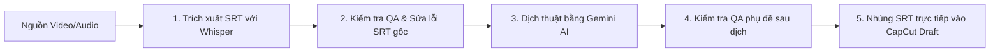

# 🎬 CapcutInjector Pro (InjectCapcut)

**CapcutInjector Pro** là bộ công cụ tự động hóa toàn diện dành cho biên tập viên video, giúp **trích xuất, dịch thuật, kiểm tra QA và nhúng phụ đề trực tiếp vào bản nháp (Draft) CapCut PC** một cách nhanh chóng và chính xác.

---

## 🌟 Tính năng nổi bật

### 1. 💉 Nhúng phụ đề trực tiếp vào CapCut PC (CapCut Draft Injector)
* Nhúng file phụ đề `.srt` trực tiếp vào tệp `draft_content.json` của CapCut PC mà không cần nhập thủ công.
* Tự động phát hiện và đóng phần mềm CapCut đang chạy để tránh lỗi ghi file (*Permission Denied*).
* Hỗ trợ gộp câu thông minh (`GROUP_SRT`) giúp khớp tốc độ đọc và thời lượng hiển thị.

### 2. 🤖 Dịch thuật phụ đề bằng Gemini AI
* Dịch phụ đề tự động bằng **Google Gemini AI** (Hỗ trợ Gemini API Key & Gemini Web qua Selenium/Playwright).
* Giữ nguyên chính xác mốc thời gian (Timecode) của file SRT gốc.
* Tự động sửa xưng hô, chuẩn hóa thuật ngữ và xử lý ngữ cảnh câu dịch mượt mà.

### 3. 🎙️ Trích xuất phụ đề tự động (Speech-to-Text)
* Tích hợp **Faster-Whisper** giúp tự động nghe và tạo phụ đề từ file Video/Audio với độ chính xác cao.
* Tốc độ xử lý siêu nhanh, hỗ trợ đa ngôn ngữ (Tiếng Trung, Tiếng Anh, Tiếng Việt,...).

### 4. 🧹 Kiểm duyệt & Sửa lỗi Phụ đề tự động (SRT QA & Repair)
* Kiểm tra chất lượng phụ đề trước và sau khi dịch (`auto_qa_repair.py`, `qa_srt_before.py`).
* Tự động phát hiện các lỗi: Dòng quá dài (>42 ký tự), đè mốc thời gian (overlap), dịch thiếu câu, ký tự lỗi.
* Công cụ thay thế từ hàng loạt (**Batch Replace SRT**) theo từ điển tùy chỉnh.

### 5. 📥 Tải Video & Phụ đề Bilibili
* Tích hợp công cụ tải video chất lượng cao từ Bilibili (`bilibili_downloader.py`).
* Tự động tải kèm file phụ đề gốc tiếng Trung hoặc tiếng Việt nếu có.

---

## 📁 Cấu trúc thư mục dự án

```text
New/
├── gui.py                   # Giao diện chính ứng dụng (PyQt6 GUI v1)
├── gui_v2.py                # Giao diện nâng cấp giao diện mới (PyQt6 GUI v2)
├── requirements.txt         # Danh sách thư viện Python cần thiết
├── README.md                # Tài liệu hướng dẫn sử dụng dự án
└── src/                     # Thư mục mã nguồn xử lý logic (Backend)
    ├── backend.py           # Logic chính nhúng phụ đề & xử lý draft CapCut
    ├── gemini_core.py       # Khởi tạo & quản lý kết nối Gemini AI
    ├── gemini_translate.py  # Xử lý dịch thuật file SRT bằng AI
    ├── subtitle_generator.py# Trích xuất phụ đề từ Audio/Video bằng Faster-Whisper
    ├── bilibili_downloader.py# Tải video và phụ đề từ Bilibili
    ├── auto_qa_repair.py    # Kiểm tra QA và tự động sửa lỗi phụ đề
    ├── qa_srt_before.py     # Kiểm tra độ dài & định dạng phụ đề trước khi dịch
    ├── srt_utils.py         # Tiện ích đọc, ghi, cắt, gộp và định dạng file SRT
    └── batch_replace_srt.py # Thay thế thuật ngữ hàng loạt trong file phụ đề
```

---

## 🛠️ Hướng dẫn cài đặt & Chuẩn bị

### Yêu cầu hệ thống:
* **Hệ điều hành**: Windows 10/11
* **Python**: Phiên bản 3.10 trở lên
* **CapCut PC**: Đã cài đặt trên máy
* **FFmpeg**: Đã cài đặt và thêm vào PATH hệ thống (để xử lý âm thanh/video)

### Các bước cài đặt:

1. **Clone hoặc tải dự án về máy:**
   ```bash
   git clone https://github.com/XunNghiax/NewInject.git
   cd NewInject
   ```

2. **Tạo môi trường ảo (Khuyên dùng):**
   ```bash
   python -m venv venv
   # Kích hoạt trên Windows PowerShell:
   .\venv\Scripts\Activate.ps1
   ```

3. **Cài đặt các thư viện phụ thuộc:**
   ```bash
   pip install -r requirements.txt
   ```

---

## 🚀 Hướng dẫn sử dụng

### 1. Khởi chạy ứng dụng (Giao diện GUI)

Mở Terminal tại thư mục dự án và chạy:

```bash
python gui.py
```
*hoặc phiên bản giao diện v2:*
```bash
python gui_v2.py
```

### 2. Quy trình làm việc tiêu chuẩn (Workflow)



1. **Trích xuất phụ đề**: Chọn file Video/Audio -> Nhấn **Tạo phụ đề** bằng Faster-Whisper.
2. **Dịch phụ đề**: Tải file `.srt` lên tab Dịch thuật -> Nhập **Gemini API Key** -> Chọn ngôn ngữ dịch -> Nhấn **Bắt đầu dịch**.
3. **Sửa lỗi phụ đề (QA)**: Chạy kiểm tra tự động để gộp các câu ngắn hoặc cắt câu quá dài.
4. **Nhúng vào CapCut**:
   - Chọn thư mục **Draft CapCut** (Thường ở `C:\Users\<Tên_User>\AppData\Local\CapCut\User Data\Projects\com.lveditor.draft`).
   - Chọn file `.srt` đã dịch.
   - Nhấn **Nhúng Phụ Đề vào CapCut**.

---

## 📦 Đóng gói thành phần mềm độc lập (.exe)

Nếu bạn muốn tạo file `.exe` để sử dụng không cần chạy qua lệnh Python:

```bash
pyinstaller --noconfirm --windowed --name "CapcutInjector_Pro" gui.py
```

File `.exe` hoàn chỉnh sẽ nằm trong thư mục `dist/CapcutInjector_Pro/`.

---

## ❓ Câu hỏi thường gặp & Tránh lỗi (Troubleshooting)

* **Lỗi `Permission Denied` khi nhúng phụ đề:**
  * *Nguyên nhân:* Phần mềm CapCut PC đang mở file dự án đó.
  * *Khắc phục:* Đóng hoàn toàn phần mềm CapCut PC trước khi nhấn nhúng phụ đề (Ứng dụng có tính năng tự động đóng CapCut để bảo vệ file).
* **Không nhận diện được API Key Gemini:**
  * Kiểm tra lại API Key trên Google AI Studio và đảm bảo máy tính có kết nối Internet ổn định.
* **Lỗi thiếu FFmpeg:**
  * Tải FFmpeg từ trang chủ và thêm thư mục `bin` vào môi trường hệ thống (Environment Variables).

---

## 📝 Giấy phép (License) & Tác giả
* **Tác giả**: XunNghiax / Yi
* **Dự án**: CapCut Injector Pro Suite