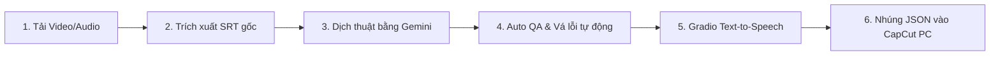

# 🎬 CapcutInjector Pro (V2 Automation Suite)

**CapcutInjector Pro** là bộ công cụ tự động hóa toàn diện dành cho biên tập viên video, giúp **tải video, trích xuất phụ đề, dịch thuật bằng AI, tạo giọng nói ảo (TTS) và nhúng trực tiếp vào bản nháp (Draft) CapCut PC** một cách hoàn toàn tự động và chính xác.

Phiên bản mới nhất đã được **tái cấu trúc toàn diện (Refactored)** theo tiêu chuẩn Hướng Đối Tượng (OOP) và mô hình MVC để đạt độ ổn định tối đa.

---

## 🌟 Tính năng nổi bật

### 1. 🤖 Trí tuệ Nhân tạo Trung tâm (Gemini Playwright Bot)
* Sử dụng Playwright để điều khiển Google Gemini (bản Web) thay vì dùng API trả phí.
* **Auto Profile Rotation:** Tự động phát hiện khi tài khoản bị khóa hoặc ép xuống bản Flash-Lite, từ đó tự động xoay vòng sang Profile Chrome khác (Pro/Advanced) mà không hỏng luồng chạy.
* Luồng xử lý chia nhỏ phụ đề (Split/Merge) thông minh để vượt qua giới hạn độ dài văn bản của Gemini.

### 2. 🎙️ Sinh âm thanh ảo (Gradio TTS)
* Đọc phụ đề tiếng Việt và tạo ra các file âm thanh (`.wav`) thông qua API Gradio.
* **Just-in-time Pause:** Nếu server Gradio (Colab) bị sập dọc đường, hệ thống tự động tạm dừng (pause) tiến trình, báo cho người dùng nạp lại link mới rồi chạy tiếp tục đúng chỗ bị đứt.

### 3. 🧹 Tự động vá lỗi phụ đề (Auto QA & Repair)
* `srt_manager.py` quét và phát hiện các lỗi thời gian đè lên nhau (overlap) hoặc đoạn text dài bất thường.
* Sinh báo cáo lỗi, tự động gửi báo cáo cho AI để lấy bản vá (Patch) và chèn lại vào đúng vị trí trong file SRT gốc.

### 4. 💉 Nhúng trực tiếp vào CapCut PC (CapCut Draft Injector)
* Nhúng hàng loạt file phụ đề `.srt` và các file âm thanh `.wav` trực tiếp vào tệp `draft_content.json` của dự án CapCut.
* Tự động tính toán mốc thời gian (Microseconds) khớp 100% với mốc gốc.
* Không cần căn chỉnh thủ công bằng tay trên timeline.

### 5. 📥 Tích hợp tải Video Bilibili & Sinh phụ đề Whisper
* Dán link là tải: Sử dụng `yt-dlp` tải video gốc, sau đó đẩy qua mô hình `Whisper` để bóc băng (Speech-to-text) ra phụ đề tiếng Trung gốc.

---

## 📁 Cấu trúc thư mục dự án (Chuẩn MVC)

```text
New/
├── gui_v2.py                # [View] Giao diện người dùng chính (PyQt6 v2). Khởi tạo luồng.
├── gui.py                   # Giao diện cũ (v1) - Dùng để tham khảo.
├── README.md                # Tài liệu hướng dẫn sử dụng dự án.
├── ARCHITECTURE.md          # Tài liệu chi tiết về kỹ thuật và luồng hệ thống.
└── src/                     # [Core/Model] Thư mục mã nguồn xử lý logic (Backend)
    ├── gemini_bot.py        # Trí não AI trung tâm, điều khiển Playwright tương tác Google Gemini.
    ├── srt_manager.py       # "Tổng quản lý" phụ đề. Cắt/gộp, quét lỗi, vá lỗi, dãn tốc độ thời gian.
    ├── workflow_translate.py# Dây chuyền tự động dịch thuật (Sử dụng GeminiBot & SrtManager).
    ├── workflow_qa.py       # Dây chuyền tự động vá lỗi phụ đề.
    ├── backend.py           # Chuyên gia thao tác mã nguồn file Draft JSON của phần mềm CapCut PC.
    ├── workers.py           # [Controller/Thread] Chạy đa luồng (Multi-threading) ngầm bảo vệ UI.
    ├── bilibili_downloader.py # Tải video và phụ đề từ Bilibili.
    ├── subtitle_generator.py  # Trích xuất phụ đề từ Audio/Video bằng Whisper.
    ├── config_manager.py      # Quản lý lưu/đọc cấu hình người dùng (user_config.json).
    └── utils.py               # Các hàm tiện ích độc lập hệ thống.
```

---

## 🚀 Quy trình làm việc tự động 6 bước (Automated Pipeline)

Hệ thống hoạt động theo dạng dây chuyền liên tục:



1. **Khởi chạy ứng dụng:** Mở terminal và gõ `python gui_v2.py`.
2. **Cấu hình ban đầu:** Chọn thư mục xuất file, dán link tải video hoặc chọn file có sẵn.
3. **Bật tiến trình:** Bấm nút **Bắt đầu toàn bộ tiến trình**. Mọi thứ từ kéo video, nghe chép, dịch thuật, kiểm tra lỗi, đọc âm thanh, đến chèn vào CapCut sẽ diễn ra tự động 100%.

---

## 🛠️ Hướng dẫn cài đặt & Chuẩn bị

### Yêu cầu hệ thống:
* **Hệ điều hành**: Windows 10/11
* **Python**: Phiên bản 3.10 trở lên
* **CapCut PC**: Đã cài đặt trên máy
* **Trình duyệt**: Khuyến nghị cài đặt Chrome.

### Các bước cài đặt:

1. **Clone dự án về máy:**
   ```bash
   git clone https://github.com/XunNghiax/NewInject.git
   cd NewInject
   ```

2. **Cài đặt thư viện:**
   ```bash
   pip install -r requirements.txt
   ```
   *(Cần đảm bảo Playwright đã cài đặt browser: `playwright install chromium`)*

---

## ❓ Xử lý sự cố (Troubleshooting)

* **Lỗi `Permission Denied` khi nhúng phụ đề:** CapCut đang mở file dự án. Đóng hoàn toàn CapCut trước khi nhúng.
* **Mất kết nối Gradio TTS:** Nếu báo lỗi Server, tiến trình sẽ báo Tạm dừng. Bạn chỉ cần chạy lại URL Gradio mới trên Colab, dán vào UI, và hệ thống sẽ tự động Resume.
* **Gemini Playwright không chạy:** Xóa thư mục `user_data/chrome_profiles` để ép hệ thống tạo phiên đăng nhập (Profile) mới từ đầu.

---

## 📝 Giấy phép (License) & Tác giả
* **Tác giả**: XunNghiax / Yi
* **Dự án**: CapCut Injector Pro Suite